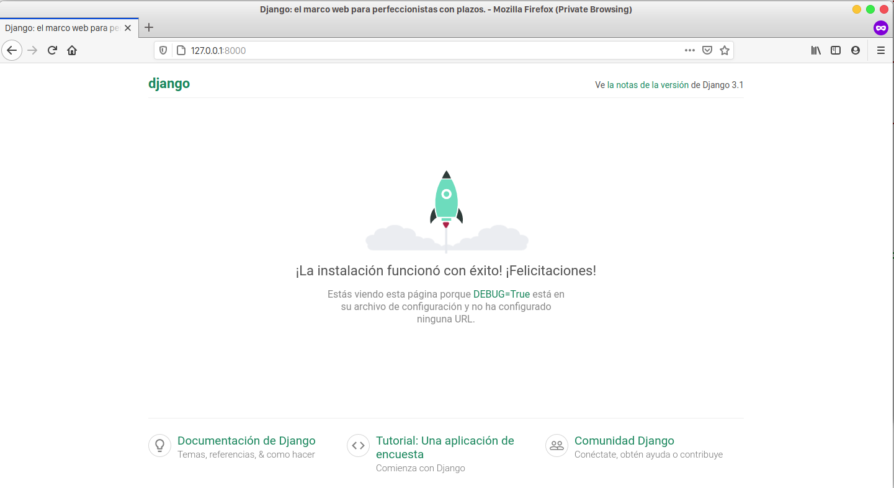
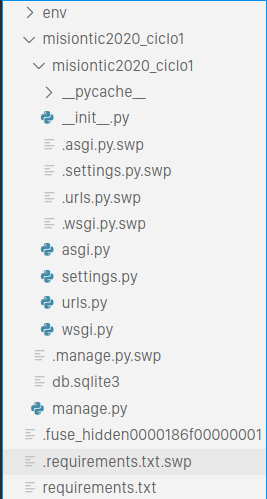
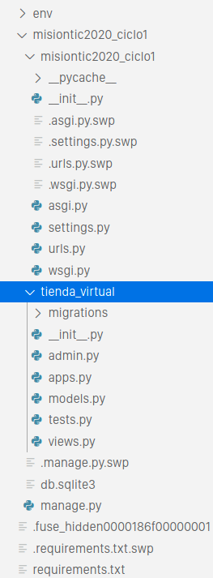
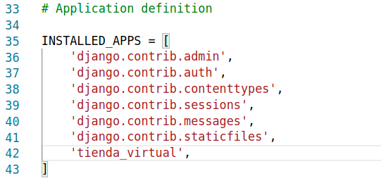

# MinTIC2020 Ciclo 1
Bienvenido al repositorio que contiene el ejercicio de cierre del Ciclo 1 de MisiónTIC 2022 del Gobierno de Colombia.
En este ejercicio usted realizará un paso a paso en donde usando los conocimientos aprendidos en python, nuevas cosas que va a aprender, y algunos elementos previamente construidos por sus profesores, creara un versión bastante sencilla de una Tienda Virtual.
De esta manera, usted podrá ver de una forma directa como utilizar los conceptos que aprendió en este ciclo, además de evidenciar la importancia del trabajo en equipo con otros roles tradicionales (como el caso de los desarrolladores front-end) en la conformación de equipos de desarrollo de software.


## Pre-requisitos 
Para el presente ejercicio usted debe contar con una versión de `Python >= 3.6`. Si no es así, por favor, actualice su versión de Python.

Este ejercicio deberá correrse sobre un IDE (el presentado en el curso es VS Code), por lo cual se recomienda no intentar hacer el ejercicio en CoLAB o en Repl.it.

Adicionalmente, deben instalarse unos módulos de la galería de Python que son de bastante uso en el desarrollo de aplicaciones web.

En primera instancia, usted debe tener un entorno virtual construido, para evitar conflictos versiones de módulos y tecnologías que usted tenga en otros proyectos.
Siendo así, vaya a la ventana de comandos (terminal, powershell, o similar), y ejecute la siguiente instrucción:.
```
python -m venv nombre_entorno
```
NOTA: En caso de que el anterior comando no se pueda ejecutar, ya que en ocasiones python no reconoce el ambiente virtual (en inglés virtual environment), deberá ejecutar el siguiente comando:

Linux:
```
sudo apt-get install python3-venv
```

Windows:
```
pip install virtualenv
```

Para este ejercicio, el nombre del entorno será `env` (es común que los desarrolladores usen `env` como nombre del entorno virtual). Para trabajar dentro del entorno virtual, primero debe activarse el mismo, lo cual puede hacer con la siguiente instrucción:
```
source env/bin/activate
```
Si usted coloco un nombre distinto para el entorno virtual, deberá ajustar la instrucción anterior.

Recuerde que al ejecutar el comando anterior el entorno virtual quedará activo. Esta activación del entorno virtual se perderá cada vez que usted apague su computador. Por lo anterior, le pedimos el favor que cada vez que cierre la terminal y vuelva a tratar de ejecutar los comandos que aparecen a continuación, ejecute nuevamente la instrucción anterior.

En este punto puede verificar la versión de python usada dentro del entorno virtual usando la instrucción:
```
python --version
```

Una vez tenga activo su entorno virtual, es momento  de crear un archivo en el cual usted coloque los módulos (y se recomienda también las versiones) que usted necesita para el desarrollo apropiado del proyecto. Estando en la raíz del proyecto, cree un archivo denominado `requeriments.txt`, y en él coloque el texto a continuación:
```
setuptools==50.3.0
Django==3.1.2
pymongo==3.11.0
```

De allí, se tienen la siguiente explicación:
- Django: Framework ampliamente reconocimiento para el desarrollo de python en web, especialmente por la facilidad que brinda al momento de manejar MVC.
- pymongo: módulo que permite la conexión y manipulación de información en el motor de base de datos de MongoDB.
- setuptools: librería que ayuda a la gestión de otros módulos con python, mantener actualizaciones, entre otros.

Ahora, luego de guardar el archivo con los módulos requeridos, puede colocar la siguiente instrucción para instalar todo lo enlistado en el archivo:
```
pip install -r requirements.txt
```

Si usted observa, tener un archivo como este es útil, primero porque puede instalar todos los módulos con una sola instrucción; segundo, porque cuando necesite recrear su entorno de desarrollo será mucho más rápido.

Para verificar la versión instalada de **Django**, puede usar la siguiente instrucción:
```
python -m django --version
```

Al ejecutar la sentencia anterior le debería aparecer lo siguiente:
```
3.1.2
```

Ahora, usted tiene su entorno de desarrollo configurado para el ejercicio de la Tienda Virtual. Ahora, es momento de entrar a trabajar con **Django**.

## Manejo Básico de **Django**
**Django** es un Framework que ayuda a mantener de manera simple y separada las vistas, las URLs, y los controladores de la lógica del negocio. Su manejo es muy sencillo, así que a continuación se hara la secuencia de instrucciones que permiten crear un proyecto en **Django**, y dentro de este proyecto una aplicación web para la creación de la Tienda Virtual.

Para crear un proyecto en **Django**, teniendo el entorno virtual activo y en la raíz de la carpeta del ejercicio, ejecute el siguiente comando:
```
django-admin startproject misiontic2020_ciclo1
```

Esto creará una carpeta llamada `misiontic_2020_ciclo1` puesto que es el nombre que se le dio al proyecto en **Django**. Dentro de esta carpeta se han auto-generado los archivos necesario para la gestión del proyecto: una carpeta con el mismo nombre del proyecto, y el archivo principal `manage.py`.
Si usted quiere darle otro nombre a su proyecto, tendrá que cambiar la cadena de caracteres final de la instrucción utilizada. 

Es momento de utilizar algún IDE y agregar la carpeta del ejercicio, para así poder modificar el código del mismo de una manera más sencilla (no vaya a cerrar la ventana de terminal, la va a utilizar de nuevo más adelante). 
Estando en el explorador de archivos del IDE, usted deberá ver en la raíz del ejercicio la carpeta `mision2020_ciclo1`; por favor, expanda esa carpeta. Al expandir, verá el archivo `manage.py`, y una carpeta llamada de nuevo `mision2020_ciclo1`.
Al expandir esta segunda carpeta, observara varios archivos de python:
- _ _init_ _.py: Define el contenido de la carpeta como un módulo de python.
- asgi.py: permite manejar el módulo como una variable de **Django**.
- settings.py: Configuraciones generales del proyecto en **Django**.
- urls.py: Listado de urls definidas para ser accedidas por el usuario en el MVC.
- wsgi.py: permite asociar la aplicación para ser lanzada automáticamente con el servidor Apache.


Por favor, dirígase al archivo de settings.py, en donde deberá realizar los siguientes cambios para ejecutar por primera vez la aplicación:
1. Djando define desde que dirección de servidor puede ser ubicado. Como va a correr en la máquina local, le recomendamos que modifique la siguiente línea de código:
```
ALLOWED_HOSTS = ['localhost', '127.0.0.1]  # linea 28
```

2. Es bueno configurar la zona del mundo, para un buen manejo de datos que tengan que ver con fecha, hora, e idioma para el usuario. Para ello, modifique las siguientes líneas de código:
```
LANGUAGE_CODE = 'es-es'  # línea 106
TIME_ZONE = 'America/Bogota'   # línea 108
```

3. Importe el módulo `os` que le da acceso a python a algunas funcionalidades propias del sistema operativo (como la creación y acceso a carpetas dentro del sistema de archivos), esto lo necesitaremos para el punto 4:
```
import os # línea 14
```


4. Finalmente, **Django** maneja temas como imágenes o código de JavaScript en la categoría de _static_. Para asegurar que no se tiene problema accediendo a las rutas de estos elementos, agregue al final del archivo la siguiente línea de código.
```
STATIC_ROOT = os.path.join(BASE_DIR, 'static')
```


Ahora, es momento de probar que todo anda funcionando correctamente. Claro, no se ha agregado nada del desarrollo web, pero se puede validar que la creación y configuración del proyecto de **Django** es correcta. Para ello, debe regresar a la ventana de comandos ó terminal, y ubicarse en la carpeta raíz del proyecto. Allí, acceda a la carpera del proyecto de **Django** usando el siguiente comando:
```
cd misiontic_2020_ciclo1"
```

estando allí, ejecute la siguiente instrucción que colocará el proyecto disponible para acceder desde cualquier navegador web:
```
python manage.py runserver
```

Ahora, usando cualquier navegador coloque la dirección: [http://localhost:8000](http://localhost:8000), y allí vera una ventana con un cohete que le indicará que el proyecto en **Django** está bien construido hasta ahora.



Para continuar, por favor regrese a la ventana de comandos o terminal, y haga la siguiente secuencia de teclas: `Ctrl + C`. Esta secuencia de comandos se realiza para detener la ejecución de **Django**.

Verifique que su estructura de archivos del proyecto dentro de **Visual Studio Code** se parezca a la siguiente imagen:



Es momento de crear la aplicación web dentro del proyecto de **Django**. Es importante mencionar que en **Django** se pueden tener varias aplicaciones web, en el caso de que quiera trabajar un proyecto por componentes interconectados. Para nuestro ejercicio, solo se tendrá una aplicación web, la cual será la tienda virtual; para crearla, utilice la siguiente instrucción (debe mantenerse ubicado en la raíz del proyecto de **Django**, donde está el archivo de `manage.py`):
```
python manage.py startapp tienda_virtual
```

Una vez ejecute el anterior comando, verifique nuevamente si su estructura de archivos se parece a la siguiente imagen:



En nuestro proyecto, la app se llama `tienda_virtual`. Si usted quiere darle otro nombre, debe cambiar el final de la instrucción utilizada anteriormente. Una vez se haya ejecturado esta instrucción, se creará una carpeta con el mismo nombre de la app, y tendrá los archivos fundamentales para el manejo del MVC en **Django**.

Adicionalmente, debe ir al archivo de "settings.py" dentro de la aplicación mision **misiontic2020_ciclo1**, ese mismo que modificó hace un par de pasos atrás, y en la lista de `INSTALLED_APPS` agregue el siguiente elemento:
```
'tienda_virtual', #~línea 41
```

El archivo se debe parecer a la siguiente imagen:




Listo, usted ha creado su primer proyecto de **Django** con una definición inicial de una aplicación web embebida en el mismo.


## Vistas Web de la Tienda Virtual 
Inicialmente se van a definir las posibles vistas de la Tienda Virtual, es decir, las pantallas gráficas que van a ser utilizadas. 
Primero, se necesita de un par de carpetas dentro de la carpeta `tienda_virtual` (carpeta de la aplicación). El nombre de la primera carpera será `static`, el nombre de la segunda carpeta es `templates`. Adicionalmente, dentro de cada carpeta debe recomienda exista una carpeta llamada `tienda_virtual`, de nuevo; todo este proceso lo puede verificar usando el IDE de desarrollo. 

Es decir, dentro de la carpeta `tienda_virtual` usted deberá tener las siguientes rutas de carpetas:
- _static/tienda_virtual/_: Carpeta en la cual se colocan todos los elementos que se consideran como estáticos, es decir, imágenes, archivos de estilo (css), archivos de Javascript, entre otros.
- _templates/tienda_virtual/_: En **Django** los `templates` se refieren a los archivos `HTML` que serán usados dentro de la aplicación.

Para este ejemplo en particular, el contenido de ambas carpetas será proporcionado. Por un lado, en la carpeta `static` se tendrá una imagen a forma de banner y un archivo de estilos para que su sitio web se vea bien. Por otro lado, en la carpera `templates` se tendrán los siguientes archivos HTML:
- _base.html_: Es un archivo que sirve para definir los elementos generales que van a tener todas las pantallas web, como banners, menú, pies de página, estilos, entre otros. Todos los otros archivos HTML invocaran este archivo, y así en cada uno solo se colocará el contenido que puntualmente le corresponde.
- _index.html_: Página principal que se va a mostrar al usuario. Tiene la información general de la aplicación web.
- _lista_productos.html_: Se muestran la lista de productos que pueden ser agregados al carrito de compras.
- _carrito_compras.html_: Se muestra el carrito de compras con los productos que han sido agregados y el costo total de la compra.
- _pagar.html_: Se muestra un formulario que permite realizar el pago de los productos en el carrito de compras.
- _historial.html_: Se muestra el historial de las compras realizadas en la Tienda Virtual.

Una vez se tengan los archivos `HTML` en la ubicación correcta, se debe hacer la relación de estas vistas en **Django**. Para ello, en la carpera de la aplicación, en este caso `tienda_virtual` en la raíz del proyecto de **Django**, existe un archivo llamado `views.py`. Este archivo solo tiene la importación de una función llamada `render`, la cual se utiliza para cargar el `HTML` de acuerdo a la vista que se quiera presentar.

Para relacionar las vistas del MVC se tiene un proceso sencillo: para cada pantalla, se debe crear una función, con un nombre a gusto del programador, pero como siempre, se recomienda que el nombre sea bastante claro y diciente; independiente del nombre de la función, esta debe recibir como argumento un `request`. 

Dentro de esta función, usted puede colocar distintas dinámicas, como cargar o transformar datos, pero esto será explicado más adelante. Por ahora, cada función solo retornará la renderización de la pantalla web. A continuación se coloca un código de ejemplo que correspondería a relacionar todas las pantallas que se van a usar en la `tienda_virtual`:
```
def home(request):
    return render(request, 'tienda_virtual/index.html')

def carrito(request):
    return render(request, 'tienda_virtual/carrito_compras.html')

def historial(request):
    return render(request, 'tienda_virtual/historial.html')

def productos(request):
    return render(request, 'tienda_virtual/lista_productos.html')

def pagos(request):
    return render(request, 'tienda_virtual/pagar.html')
```

Como puede observar, la función de `render` tiene dos parámetros: (i) el `request` que recibió la función de la vista, y (ii) la ruta al archivo `HTML`. Es importante mencionar que en este caso, **Django** interpreta a la carpeta `template` como la raíz de los fuentes de `HTML`, por eso no es necesario agregar eso a la ruta del archivo. 

Por ahora, esto es suficiente para relacionar las vistas de manera básica y que **Django** las pueda gestionar. 

## URLs de la Tienda Virtual 
Si bien usted ya relaciono las vistas para que **Django** las reconozca, aún debe enlazar cada una de esas vistas a una `URL` para que puedan ser accedidas en el navegador web. Para ello, en la carpeta de la aplicación `tienda_virtual`, cree un archivo denominado `urls.py`. Así como para cada pantalla web usted creo una función en `views.py`, cada una de dichas funciones para ser invocada debe ser agregada a una lista de patrones de _URL_ (`urlpatterns`), es decir, por cada pantalla web debe haber un patrón de _URL_ relacionado el cual si el usuario coloca en el navegador web, le indica a **Django** cuál de las pantallas web debe ser renderizada.

En el archivo `urls.py` que usted creo deberá importar dos cosas: (i) la función de **Django** para colocar las rutas de las _URLs_, y (2) las funciones que previamente usted ha definido en el archivo `views.py`. Para importar todas las funciones de otro archivo solo es necesario importar el mismo archivo, y en este caso, como tanto el archivo de `urls.py` y el archivo `views.py` están en la misma carpeta, se usa un `.` para indicarle esto a **Django**.

En cuanto a la lista de patrones de _URL_, se requiere crear una variable llamada `urlpatters`, la cual almacenará dicha lista. Cada _URL_ a agregar se hace con la función `path`, la cual recibe tres argumentos: la expresión regular que representa la _URL_, la vista que debe ser renderizada cuando se busque dicha _URL_, y un nombre identificador de la _URL_. Un ejemplo de esto se muestra a continuación: 
```
path('regex', views.funcion_vista, name="nombre")
```

Así, en nuestro caso, el archivo `urls.py` en la carpeta de la aplicación `tienda_virtual` deberá tener un código similar al que se presenta como sigue:

```
from django.urls import path
from . import views

urlpatterns = [
    path('', views.home, name="inicio"),
    path('carrito_compras/', views.carrito, name="carrito"),
    path('historial_compras/', views.historial, name="historial"),
    path('productos/', views.productos, name="lista_productos"),
    path('portal_pagos/', views.pagos, name="pagos"),
]
```

Sin embargo, ese archivo `urls.py` relaciona las _URLs_ en particular de la aplicación `tienda_virtual`, pero si usted tiene muchas más aplicaciones en el mismo proyecto de **Django** va a tener un archivo de estos por cada aplicación. Ahora, y entendiendo que puede ser un poco confuso, así como cada aplicación tiene un archivo `url.py`, el proyecto global de **Django** tiene su propio archivo `urls.py`, el cual se encuentra en la carpera de configuración del proyecto (en este caso, la carpeta llamada `misiontic_2020_ciclo1/misiontic_2020_ciclo1`). En este archivo debe importar todos los archivos de _URL_ de cada uno de los proyectos. Para ello, debe importar la función `include` que está en el módulo de `django.urls`.

Luego, en la lista, ya existente, llamada `urlpatterns`, debe agregar un elemento en la cual relacione  `aplicacióo.urls` por cada aplicación que tenga. EN nuestro caso, este archivo debería quedar como el siguiente código:

```
from django.contrib import admin
from django.urls import path, include

urlpatterns = [
    path('admin/', admin.site.urls),
    path('tienda_virtual/', include('tienda_virtual.urls')),  
]
```

Luego de tener definidas las _URLs_, se debe verificar que los enlaces en el menú el archivo `tienda_virtual/templates/tienda_virtual/base.html` sean los correctos, y así la navegación en el sitio web sea la esperada. Para nuestro ejemplo, así se vería el menú del archivo `HTML`, en donde en los atributos de `href` se observan las _URLs_ que se relacionaron para la aplicación:
```
<div align="center" width="100%">
    <table>
        <tr>
            <td><b><a href="/tienda_virtual/">Inicio</a>&nbsp;&nbsp;|&nbsp;&nbsp;</b></td>
            <td><b><a href="/tienda_virtual/productos/">Productos</a>&nbsp;&nbsp;|&nbsp;&nbsp;</b></td>
            <td><b><a href="/tienda_virtual/carrito_compras/">Carrito de Compras</a>&nbsp;&nbsp;|&nbsp;&nbsp;</b></td>
            <td><b><a href="/tienda_virtual/historial_compras/">Historial de Compras</a></b></td>
        </tr>
    </table>
</div>
```


Este es un buen momento para verificar que todo ande funcionando bien. Se recomienda volver a utilizar el comando para poner al proyecto de **Django** disponible para acceder a través de navegador web. Por si lo olvido, vaya a la carpera raíz del proyecto, y realice la instrucción:
```
python manage.py runserver
```

Ahora, verá un sitio web sencillo, con el banner, y la opción de navegar a través del menú y las diferentes pantallas. Para acceder a la tiendar virtual, por favor vaya al siguiente link [http://localhost:8000/tienda_virtual](http://localhost:8000/tienda_virtual).


## Formularios a Desarrollar 
Es momento de agregarle dinámica a nuestra **Tienda Virtual**, es decir, mover información entre el sitio web y la base de datos, además de algunos cálculos con los datos.

Primero, se van a definir los formularios a usar en nuestra aplicación. **Django** tiene una forma bastante sencilla para construir dichos formularios y enlazarlos a las pantallas web, y para ello se recomienda crear un archivo denominado `forms.py` en la raíz de la aplicación (la misma en donde está el archivo `views.py`). 

Para crear un formulario, se debe crear una clase (tranquilo, sabemos que clases no fue un tema de este ciclo, pero por ahora, va a ser un manejo sencillo de las mismas); similar a como se crea una función, se tiene una palabra reservada llamada `class` que permite crear una clase, luego debe ir el nombre, y finalmente un argumento el cual será un formulario de **Django**, así que debera importar un módulo para esto. Un ejemplo de código de lo mencionado se muestra a continuación:
```
#archivo forms.py
from django import forms

class formulario(forms.Form):
    #bloque
```

Como puede observar, con la línea `from django import forms` se importa el módulo de formularios de **Django**, y este módulo es el que utiliza la clase como argumento para construir los formularios.

**Django** en su módulo `forms` proporciona una serie de componentes clásicos de los formularios (lo invitamos a revisar [] la documentación de correspondiente para mayor detalle). Para este ejercicio, vamos a utilizar dos componentes de los más utilizados, y que serán suficientes para nuestros propósitos:
- _forms.CharField_: Se refiere a un campo de texto abierto, en donde el usuario puede escribir de manera libre. Esto quiere decir que este componente entrega información que es tipo de dato `string`.
- _forms.ChoiceField_: Se refiere a un campo con opciones desplegables de las cuales solo se debe seleccionar una. Este campo suele ser alimentado con una lista de tuplas (parejas), y la tupla seleccionada será la información entregada por el componente.

Para hacer una **Tienda Virtual** sencilla, se van a manejar dos formularios, uno para agregar productos al carrito, y otro para el proceso de pago. 

En nuestro ejemplo, el primer formulario se llamará `agregar_producto`, y tendrá un campo desplegable para el _producto_ seleccionado (por ahora será una lista vacía), y otro campo desplegable para la _cantidad_ (lista que se puede construir utilizando un ciclo `for` y una función `range` en donde usted definirá la máxima cantidad de elementos que un usuario puede llevar); ambos campos son obligatorios. A continuación se muestra un código para ejemplificar esta definición:
```
class agregar_producto(forms.Form):
    productos = ()
    cantidad = ((i, i) for i in range(16))
    
    producto = forms.ChoiceField(label = "Producto", required=True, choices=productos)
    cantidad = forms.ChoiceField(label = "Cantidad", required=True, choices=cantidad)
```

El segundo formulario se llamará `pagar_carrito`, el cual tendrá un campo desplegable para el método de pago (se crea una lista de con tuplas de manera manual), un campo de texto para colocar la dirección de entrega, y un campo de observaciones. El _método de pago_ y la _dirección_ son obligatorios; el campo de _observación_ es opcional. A continuación se muestra un ejemplo de como podría quedar construido este formulario:
```
class pagar_carrito(forms.Form):
    metodos = (('Tarjeta de Crédito', 'Tarjeta de Crédito'), ('Pago en Efectivo', 'Pago en Efectivo'), ('Tarjeta Débito', 'Tarjeta Débito'))

    metodo_pago = forms.ChoiceField(label = "Método de Pago", required=True, choices=metodos)
    direccion = forms.CharField(label = "Dirección de Envío", required=True)
    observaciones = forms.CharField(label = "Observaciones", required=False)
```

Luego de construir los formularios, se pueden agregar dinámicas al sitio web usando _Python_ que usted ya conoce.


## Código Python dentro del HTML 
Para transferir cualquier información adentro de los HTML, la forma más sencilla es generar un diccionario con los ítems que se quieran presentar en la web, y enviarlo como tercer parámetro en la función `render` que se está utilziando en el archivo `views.py`. Una definición sencilla de esto se muestra a continuación:
```
parametros = {'clave_1': 'valor_11',..,'clave_n': 'valor_n'}
render(request, 'tienda_virtual/archivo.html', parametros)
```

En este sentido, es importante definir que se requiere tener en cada una de las pantallas web a trabajar. Para un ejercicio sencillo como el que se está trabajando, se definen estas necesidades como sigue:
- `carrito_compras.html`: Se deben mostrar los productos que el usuario ha agregado al carrito. 
- `historial.html`: Se debe mostrar el historial de compras realizadas en la **Tienda Virtual**.
- `lista_productos.html`: Se debe mostrar la lista de productos y la opción de agregarlos al carrito de compras.
- `pagar.html`: Se debe mostrar el formulario de pago para que el usuario diligencie, además de motrar el valor total de la compra. 


Así, un ejemplo de cómo podría quedar el archivo `views.py` se muestra a continuación:
```
from django.shortcuts import render
from . import forms

# Create your views here.
def home(request):
    return render(request, 'tienda_virtual/index.html')

def carrito(request):
    productos = []
    parameters = {'productos':  productos}
    return render(request, 'tienda_virtual/carrito_compras.html', parameters)

def historial(request):
    historial = []
    parameters = {'historial':  historial}
    return render(request, 'tienda_virtual/historial.html', parameters)

def productos(request):
    frm_agregar = forms.agregar_producto()
    parameters = {'frm_agregar' :  frm_agregar}
    return render(request, 'tienda_virtual/lista_productos.html', parameters)

def pagos(request):
    frm_pago = forms.pagar_carrito()
    parameters = {'frm_pago' :  frm_pago}
    return render(request, 'tienda_virtual/pagar.html', parameters)
```

Para hacer una correcta interacción entre **Django** y el `HTML`, se deben en cuenta varios aspectos:
- Para utilizar elementos que se encuentren en la carpeta `static` de la aplicación, al inicio del archivo `HTML` se debe agregar la sentencia ``.
- Para reemplazar el contenido del archivo `HTML` se deben usar las sentencias `` y  `` al inicio y final del bloque respectivamente.
- Cualquier otro código _Python_ que se vaya a colocar dentro del `HTML`, dependiendo del caso, será mediante los símbolos `` (como es el caso de los ciclos y condicionales), o con los símbolos `{{ code }}` (como es el caso de las variables). 

En este caso, para agregar una lista de elementos al `HTML` debe hacer una iteracion al parámetro enviado a través del `render`. En ejemplo de un `HTML` con ciclo `for` sería el siguiente:
```

    
        {{ elemento.campo_1 }}
        {{ elemento.campo_2 }}
        ...
        {{ elemento.campo_n }}
    

```

Para colocar un formulario, solo se requiere invocarlo por la clave en el diccionario, como se muestra a continuación:
```

<form method="POST">
    {{ frm_agregar.as_p }}
    <input type="submit" value="Texto de Botón" id="btn" name="btn">
</form>

```